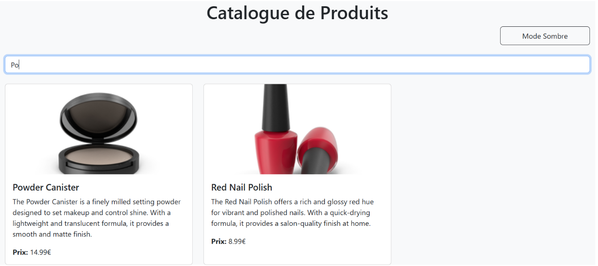
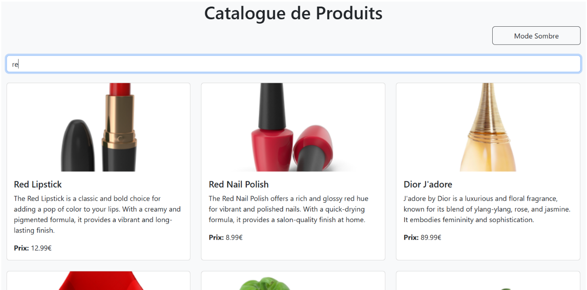
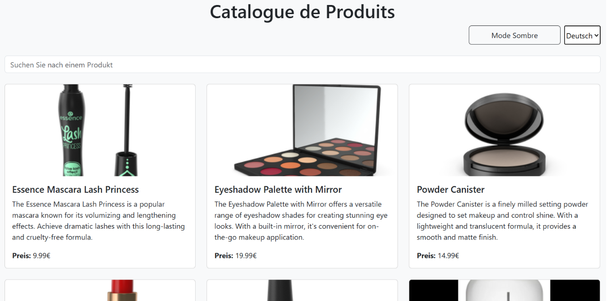
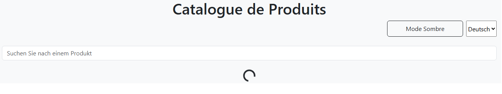
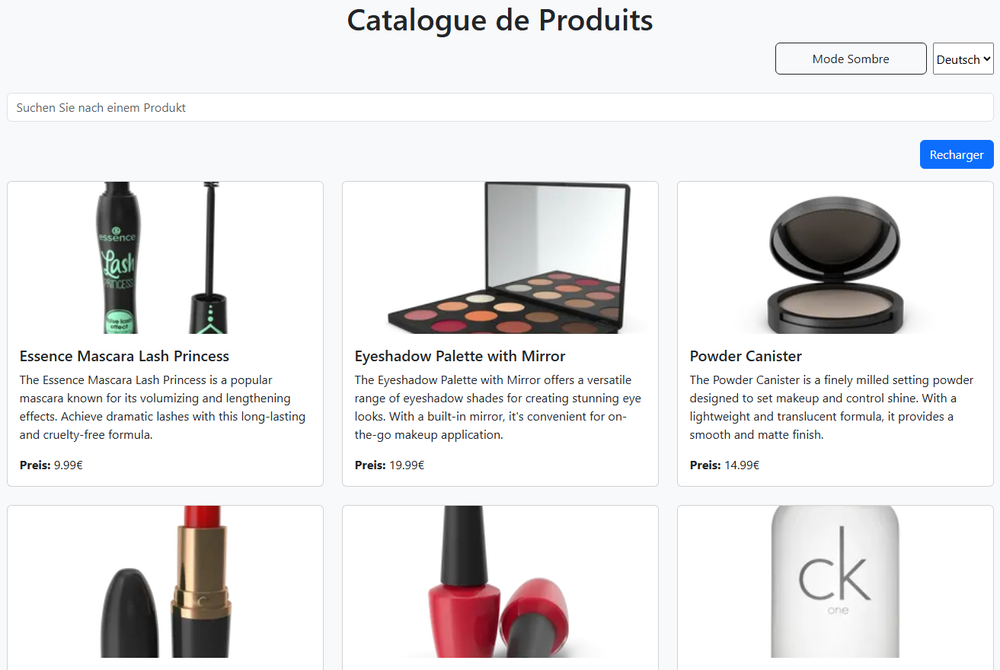
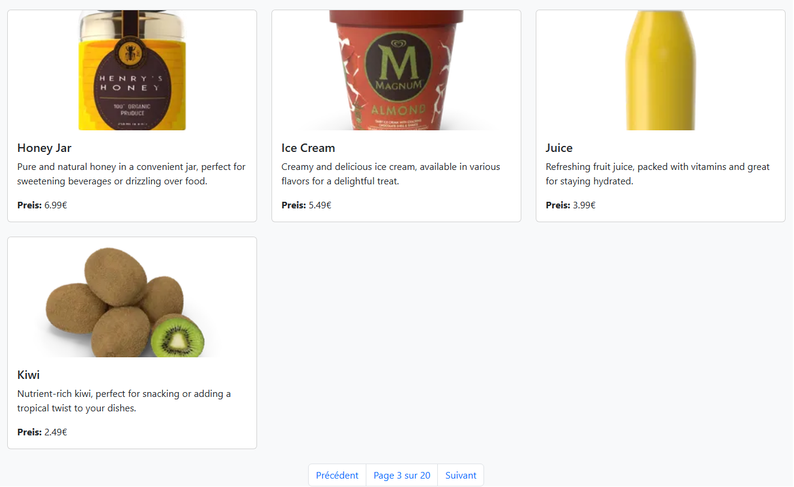

# TP React Hooks - Application de Gestion de Produits

Ce TP a pour objectif de mettre en pratique l'utilisation des Hooks React (useState, useEffect, useContext) ainsi que la création de Hooks personnalisés.

## Installation et configuration initiale

1. Cloner le dépôt :
```bash
git clone https://github.com/elghariaoui/tp-react-hooks.git
cd tp-react-hooks
```

2. Créer votre propre dépôt sur Github et changer le remote :
```bash
# Supprimer le remote origine
git remote remove origin

# Ajouter votre nouveau remote
git remote add origin https://github.com/[votre-username]/tp-react-hooks.git

# Premier push
git push -u origin main
```

3. Installer les dépendances :
```bash
npm install
```

4. Lancer l'application :
```bash
npm start
```

### Exercice 1 : État et Effets 
#### Objectif : Implémenter une recherche en temps réel

- [ ] 1.1 Modification du composant ProductSearch pour utiliser la recherche


<p align="center">

</p>

- [ ] 1.2 Implémenter le debounce sur la recherche

Un setTimeout attend 1 seconde avant de mettre à jour searchTerm.

Si l'utilisateur saisit un autre caractère avant la fin du délai, l'ancien setTimeout est annulé avec clearTimeout.

<p align="center">

</p>

### Exercice 2 : Context et Internationalisation
#### Objectif : Gérer les préférences de langue

- [ ] 2.1 Créer le LanguageContext

Contexte LanguageContext créé et stocke la langue actuelle (language) et une fonction changeLanguage pour la mise à jour.

- [ ] 2.2 Ajouter le sélecteur de langue

Utilisation du LanguageContext pour accéder à language et changeLanguage.

Mise à jour de la langue avec setLanguage().

<p align="center">
Exemple d'affichage du context en français.

</p>

### Exercice 3 : Hooks Personnalisés
#### Objectif : Créer des hooks réutilisables

- [ ] 3.1 Créer le hook useDebounce
- [ ] 3.2 Créer le hook useLocalStorage

`Hook useDebounce` : Ajout d’un délai avant la mise à jour d’une valeur.

`Hook useLocalStorage` : Permet de stocker des valeurs dans `localStorage` pour éviter la perte de données après un rafraîchissement.

<p align="center">
Etat de recherche avec useDebounce et useLocalStorage.

</p>

### Exercice 4 : Gestion Asynchrone et Pagination
#### Objectif : Gérer le chargement et la pagination

- [ ] 4.1 Ajouter le bouton de rechargement
- [ ] 4.2 Implémenter la pagination

Ajout d’un bouton Recharger pour relancer l’appel API.

Gestion de la pagination avec les fonctions nextPage et previousPage.

<p align="center">
Rechargement de la page actuelle avec le bouton Recharger.


</p>
<br>

<p align="center">
Pagination avec les boutons Précédent et Suivant.

</p>
